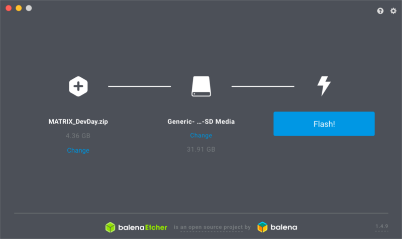

# Pre-Guide Setup
Follow this section to prepare all the necessary hardware and software so you can follow along with the Arm DevDay MATRIX Workshop.

## Required Hardware
- Everything inside the [MATRIX Workshop Kit](https://events.hackster.io/armdevday#page-block-00wo26qig3709lbmb85p63whfr).
- Personal Computer with internet access.

## Required Software
- Personal Computer:
  - [Node.js](https://nodejs.org/en/)
  - [Etcher.io](https://www.balena.io/etcher/)
  - Snips' [Sam CLI Tool](https://snips.gitbook.io/getting-started/installation)
- Registered [snips.ai](https://snips.ai/) account.

## Raspberry Pi Setup

### 1. Flashing Your Micro SD Card
Before plugging in your Raspberry Pi, you'll need to flash your Micro SD Card. Download our custom [Raspbian Stretch image](https://events.hackster.io/armdevday#page-block-00wo26qig3709lbmb85p63whfr) and open etcher.io to begin flashing.



Once flashed, reinsert the Micro SD Card into your computer. A volume named `boot` should appear. The next step will have you add your WiFi configuration into this volume.

### 2. WiFi Configuration
>**Your Pi must be on the same network as your personal computer.**

>**This step can be skipped if your Raspberry Pi has an ethernet connection.**

Create an empty file on your computer named `wpa_supplicant.conf` and add following information inside:
```
ctrl_interface=DIR=/var/run/wpa_supplicant GROUP=netdev
update_config=1

network={
    ssid="YOU_WIFI_NAME_HERE"
    psk="YOUR_WIFI_PASSWORD_HERE"
}
```

After you verify that your information is correct, drag & drop the file into the `boot` volume. You can now eject and insert the Micro SD Card into your Raspberry Pi. The MATRIX Creator should be attached as well.

### 3. SSH Into Your Raspberry Pi
Before powering on, ensure that your setup matches the gif below

